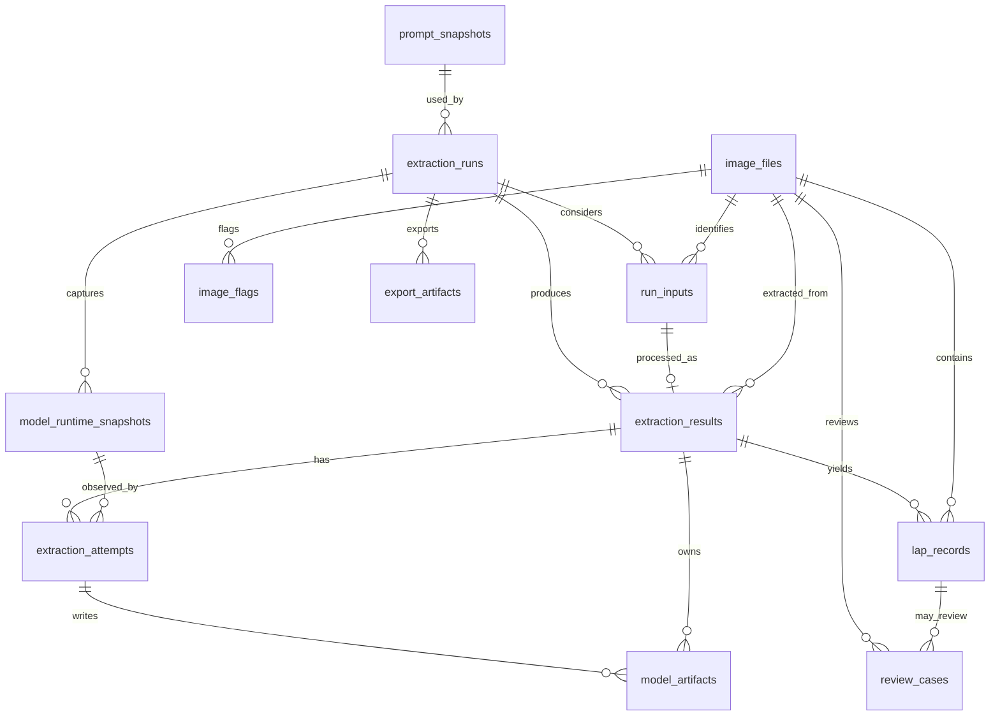

# Database Architecture: 1. Scope And Goals

Status: current
Audience: maintainer, developer, LLM
Lifecycle: permanent
Scope: Database architecture shard generated from the former oversized `database.md` document
Last verified: 2026-06-15

Back to index: [`../database.md`](../database.md).

## 1. Scope And Goals

This document defines the current vNext database architecture. It assumes a new database from scratch:

- No legacy migration requirement.
- No backward compatibility with old runtime data.
- No JSON/cache file as canonical runtime state.
- Full-run rebuild is the primary validation scenario.

The database must make these questions answerable from SQL state:

- Which files were considered by a run?
- Which files were processed, skipped, duplicated, missing, or unsupported?
- Which app settings were active?
- Which prompt text was used?
- Which LM Studio model/runtime state was observed before processing?
- Which exact chat attempts were made?
- Which raw responses and debug artifacts exist on disk?
- Which attempt was accepted?
- Which laps were produced?
- Which review cases, flags, and exports were derived from those laps?

## 2. Architecture Principles

### 2.1. Runtime Source Of Truth

SQLite is the operational source of truth. Runtime screens and rebuild paths must read SQL tables and registered artifacts, not legacy JSON snapshots or cache files.

### 2.2. Operational Errors Are Run Errors

LM Studio/preflight/backend failures that happen before an image is submitted to chat are run-level operational errors. They must be stored on `extraction_runs.operational_error_*` and must not create per-image extraction errors.

### 2.3. Every Considered Input Is Recorded

Every file considered by a run gets one `run_inputs` row, even if skipped or duplicated. This is required for progress accounting, retry explanation, and postmortem review.

### 2.4. Attempts Are The Debug Source Of Truth

`extraction_results` is a final per-image summary. `extraction_attempts` stores every real `/chat` call and all parse/retry/debug evidence.

### 2.5. Raw Response Integrity Is Mandatory

Raw model outputs are not optional. Accepted attempts must have raw response text in the database or a canonical raw artifact tracked by `model_artifacts`. Canonical artifacts must store `sha256` and `size_bytes`.

### 2.6. Prompt And Runtime State Are Immutable Evidence

Runs reference immutable `prompt_snapshots` and `model_runtime_snapshots`, so a future review can reproduce the model/prompt context used by the full run.

### 2.7. Best Laps Are Rebuildable

`lap_records.is_best_lap` is derived. It is recalculated after the run/rebuild from `lap_records`. Do not create a separate `best_lap_frontier` table initially.

### 2.8. English Is The Canonical UI/Data Vocabulary

Project UI text, operator messages, status values, logs, and docs should use English. Database enum-like values should be stable English tokens.

### 2.9. Progress Is Durable At Image And Attempt Boundaries

The application persists a result shell before image encoding/chat work, appends
each real chat attempt immediately after its raw/debug artifact is written, and
finalizes the image before honoring pause or cancellation checkpoints. A process
crash may leave a result temporarily `running`, but it must not erase completed
attempt evidence.

### 2.10. Derived State Is Rebuilt Globally

Best laps, system review cases, and system image flags are global derived state.
Rebuild must recalculate them atomically from all accepted relational results,
not only from the run that triggered rebuild. Manual review decisions are
preserved.

## 3. Naming And Status Conventions

Use current project vocabulary where it is already clear:

- `extraction_runs`
- `image_files`
- `extraction_results`
- `extraction_attempts`
- `lap_records`
- `review_cases`
- `image_flags`
- `export_artifacts`

Run status:

```text
pending | running | completed | failed | cancelled
```

Extraction result status:

```text
pending | running | ok | error | cancelled
```

Attempt status:

```text
ok | error | cancelled
```

Attempt acceptance:

```text
accepted = 1 means this attempt is the accepted final evidence for the result.
accepted = 0 means it is diagnostic/rejected evidence.
```

Best lap participation status on `image_files`:

```text
pending | contributing | non_contributing
```

`dirty_lap` is the canonical domain term. Do not introduce alternatives such as `dirty_player`.

## 4. Relationship Overview



